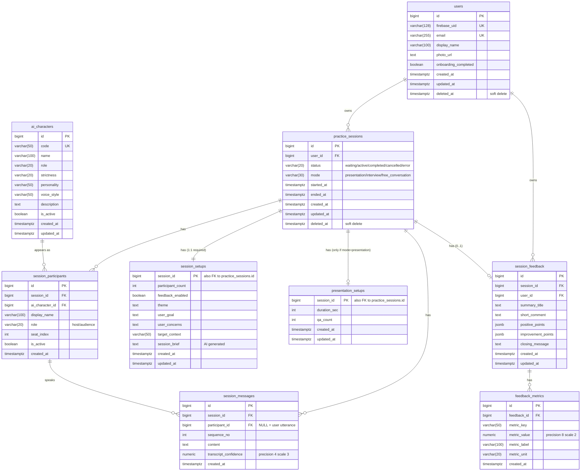

# DB Schema 将来形 (Plan A: practice_sessions 責務分割後)

`practice_sessions` の God table 化を解消するための分割案。`db-schema.md` を将来形に置き換えた版。

> 方針: **ライフサイクル単位で 1:1 テーブルに分割**し、モード固有設定はサブテーブルに切り出す。`session_feedback` と重複していた結果サマリは削除して一本化する。

---

## ER 図

---

## 現状からの変更点

| 変更 | 対象 | 内容 |
| --- | --- | --- |
| **テーブル新設** | `session_setups` | セットアップ入力と AI 生成中間データ (`session_brief`) を集約。`practice_sessions` と 1:1 必須 |
| **テーブル新設** | `presentation_setups` | `mode='presentation'` のときだけ作成。1:0..1 |
| **カラム移動** | `practice_sessions` → `session_setups` | `participant_count`, `feedback_enabled`, `theme`, `user_goal`, `user_concerns`, `target_context`, `session_brief` |
| **カラム移動** | `practice_sessions` → `presentation_setups` | `presentation_duration_sec` → `duration_sec`、`presentation_qa_count` → `qa_count` |
| **カラム削除** | `practice_sessions` | `overall_score`, `feedback_summary` を削除し `session_feedback` に一本化 |

---

## テーブル責務（変更があるテーブルのみ）

### `practice_sessions` ★中心テーブル（スリム化）

セッションの**ライフサイクル状態**だけを表す。`status` で進行 (`waiting → active → completed`)、`mode` で練習種別を保持。セットアップ詳細や結果サマリは持たない。

「このセッションは今どういう状態か」だけを聞きたいクエリ（一覧表示・進行制御）はこのテーブル単体で完結する。

### `session_setups` 【新規】

1 セッションに必ず 1 行存在する 1:1 テーブル。`session_id` を PK 兼 FK にして 1:1 を DB レベルで強制する。

格納するもの:
- ユーザがセットアップフォームで入力した値（theme, user_goal, user_concerns, target_context, participant_count, feedback_enabled）
- 入力から AI が派生生成した中間データ（session_brief）

setup の値はセッション進行中の演出制御や、フィードバック生成時のコンテキストとして読まれる。

### `presentation_setups` 【新規】

`mode='presentation'` のときだけ作成される 1:0..1 テーブル。プレゼンモード固有の `duration_sec` と `qa_count` を持つ。

NULL カラムが消え「**行が存在する = そのモードのセッションである**」と意味が明確になる。将来 `interview_setups` / `free_conversation_setups` を同じパターンで追加できる。

### `session_feedback`（責務拡大）

これまで `practice_sessions` 側にあった `overall_score` と `feedback_summary` を取り込む候補:
- `overall_score` → `session_feedback.overall_score INTEGER` として追加
- `feedback_summary` → 既存の `summary_title` / `short_comment` で代替可能なら追加不要

「**セッション終了後に AI が生成した評価**」という責務がここに集約される。

---

## カーディナリティの読み方

| 関係 | 説明 |
| --- | --- |
| `users` 1—N `practice_sessions` | 1 ユーザは多数のセッションを持つ |
| `practice_sessions` 1—**1** `session_setups` | セッションには必ず 1 つのセットアップが付随する |
| `practice_sessions` 1—**0..1** `presentation_setups` | プレゼンモードのときだけ行が存在する |
| `practice_sessions` 1—N `session_participants` | 1 セッションに複数の AI 参加者 |
| `ai_characters` 1—N `session_participants` | 同じキャラが複数セッションに出演 |
| `practice_sessions` 1—N `session_messages` | 発話履歴は時系列で増える |
| `practice_sessions` 1—**0..1** `session_feedback` | フィードバックは未生成のこともある |
| `session_feedback` 1—N `feedback_metrics` | 1 フィードバックに複数メトリクス |

---

## インデックス（変更が必要なもの）

| Index | Table | Columns | 目的 | 備考 |
| --- | --- | --- | --- | --- |
| `ix_practice_sessions_user_deleted` | `practice_sessions` | `(user_id) WHERE deleted_at IS NULL` | ユーザの有効セッション一覧 | **partial index に変更**を推奨 |
| `ix_session_messages_session_seq` | `session_messages` | `(session_id, sequence_no)` | セッション内会話履歴 | 据え置き |
| `ix_session_feedback_session_id` | `session_feedback` | `(session_id)` | セッション → フィードバック逆引き | 据え置き |
| `ix_feedback_metrics_feedback_id` | `feedback_metrics` | `(feedback_id)` | メトリクス JOIN | 据え置き |
| `ix_session_participants_session_seat` | `session_participants` | `(session_id, seat_index)` | 参加者を席順で取得 | 据え置き |

`session_setups` / `presentation_setups` は `session_id` が PK なので追加の index 不要。

---

## 設計上のポイント

### 1:1 テーブル分割のコスト

- 取得時に LEFT JOIN が必要だが、`session_id` PK 同士の merge join はコストほぼゼロ
- セッション一覧画面のような「コアだけ欲しい」クエリでは JOIN そのものが不要になり、むしろ高速化する

### NULL の意味の明確化

- 旧スキーマ: `presentation_duration_sec IS NULL` が「未設定」か「該当しないモード」か曖昧
- 新スキーマ: `presentation_setups` に行があるかどうかで「該当モードである」と判定できる

### モード追加の拡張性

将来 `interview` モード固有設定が必要になったら、`interview_setups` テーブルを同じパターンで追加するだけ。`practice_sessions` 本体を触る必要がない。

### 二重管理の解消

旧スキーマでは `practice_sessions.overall_score` と `session_feedback` の両方に評価情報があった。
新スキーマでは `session_feedback` に集約され、「フィードバック生成済みか」は `session_feedback` の有無で判定する（`practice_sessions.status='completed'` の情報と一致するため整合性も取りやすい）。

---

## 段階的移行プラン

一気に migration を当てるのではなく 3 フェーズに分割する:

### Phase 1: 重複解消（Quick win）

- `practice_sessions.overall_score`, `feedback_summary` を削除
- 参照箇所を `session_feedback` 側に変更
- 影響範囲が小さく、効果ははっきりする

### Phase 2: `session_setups` 切り出し

- 新テーブル作成 → データコピー → 参照差し替え → 旧カラム削除
- セットアップフォームの永続化先が明確になる

### Phase 3: `presentation_setups` 切り出し

- モード固有設計のテンプレートが確立する
- 以降の新モード追加が同じパターンで進む

---

## 想定 Q&A

| 質問 | 回答 |
| --- | --- |
| JOIN コストは？ | 1:1 small table の merge join はほぼ無視できる。一覧画面では JOIN 不要で逆に速くなる |
| 過剰設計では？ | 現時点で 8 個のセットアップ系カラムが混入。新モード追加で必ず破綻するため**今が一番安い** |
| JSONB に詰める案は？ | setup の値はビジネスロジックで条件分岐に使うため、型と CHECK が効く正規化テーブルが安全 |
| 既存コードへの影響は？ | repository / service の参照修正が必要。route 層と schema は最小限の変更で済むよう設計 |
