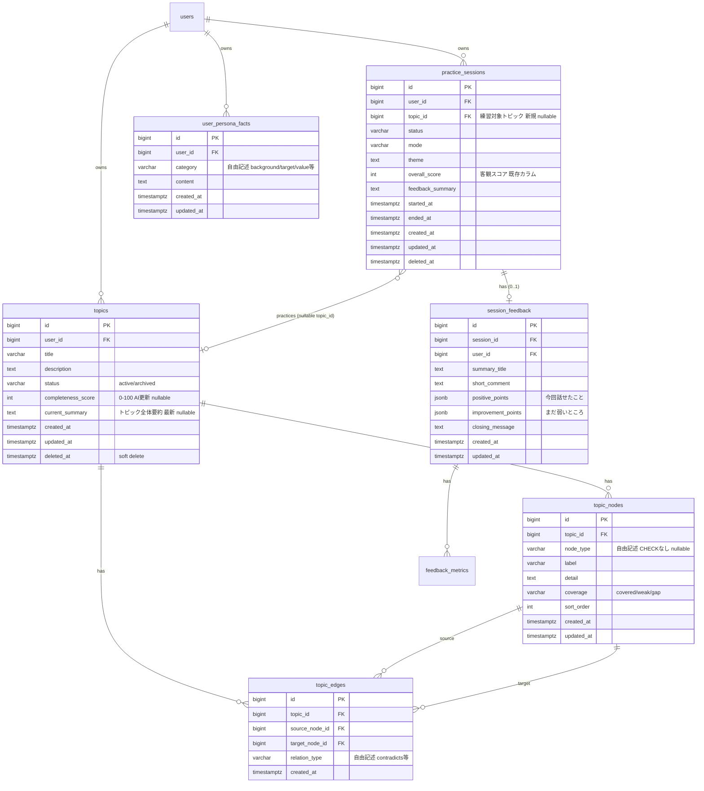

# DB Schema 拡張案 (Plan B: トピック記憶 + 仮想 GraphRAG)

`audienceroom_concept_ux_spec.md` で再定義されたコア体験を実現するための DB 拡張案。**現行スキーマ（`db-schema.md`）にそのまま追加する**形で設計する。

> `practice_sessions` 責務分割（Plan A）とは独立した拡張であり、Plan A の適用有無に関係なく現行スキーマに乗せられる。Plan A を後で当てる場合は `topic_id` の置き場所だけ `session_setups` に移せばよい（後述）。

> 方針:
> 1. 「1 練習 = 1 `practice_session`」は維持する。セッションは**揮発的な 1 回の練習**を表す。
> 2. その上に **`topics`（面接で話すエピソードを育てる永続単位）** を新設し、練習をまたいで情報を蓄積する。
> 3. トピック内の構造（論点・関係・矛盾・強み・弱み）は **ノード + エッジ** として RDB 上でグラフ的に持つ（本格 GraphDB は導入しない）。
> 4. 面接中の質問は永続ワークリストを持たず、**グラフ + ペルソナを SQL でたどって LLM が都度生成する（仮想 GraphRAG）**。pgvector は導入しない。
> 5. 自己認識と客観評価のズレは**システムが数値で明示せず、客観結果を提示してユーザが内的に比較できる形**にする（主観入力テーブルは持たない）。

このドキュメントは、設計の議論を経て当初案から下記の点を簡素化した版である（末尾「設計決定の経緯」参照）。

---

## ER 図（新規テーブルと関係を中心に）



> `practice_sessions` は既存カラムのうち関係するものだけ抜粋。`session_participants` / `session_messages` / `feedback_metrics` / `ai_characters` は現行から変更なし（図では省略）。

---

## 現状からの変更点

| 変更 | 対象 | 内容 |
| --- | --- | --- |
| **テーブル新設** | `topics` | 面接で話すエピソードを育てる永続単位。ユーザに 1:N |
| **テーブル新設** | `topic_nodes` | トピック内の論点・要素（グラフのノード）。`coverage` で「話せる/弱い/空き」を表す |
| **テーブル新設** | `topic_edges` | ノード間の関係（グラフのエッジ）。`relation_type` は自由記述で `contradicts`（矛盾）等も表す |
| **テーブル新設** | `user_persona_facts` | ユーザ横断のペルソナ情報を 1 事実 1 行で保持。質問生成の文脈に使う |
| **カラム追加** | `practice_sessions.topic_id` | そのセッションがどのトピックの練習かを示す FK（nullable） |

客観スコアは**既存の `practice_sessions.overall_score` をそのまま流用**する。「今回話せたこと/まだ弱いところ」は既存の `session_feedback.positive_points/improvement_points` を流用するため、`session_feedback` への新カラム追加は無い。

---

## テーブル責務

### `topics` 【新規・記憶層の中心】

ユーザが面接で話す**1 つのエピソード**を表す永続エンティティ。「研究内容」「自己PR」「志望動機」など。`practice_sessions` が 1 回きりの揮発的な練習なのに対し、`topics` は練習をまたいで**育っていく**。

- `completeness_score` / `current_summary` は **AI が練習後に更新する非導出値**なのでテーブルに持つ。
- 「練習回数」「最終練習日」はセッションから**導出**する（`practice_sessions.topic_id` で数える）。冗長カラムは持たず同期バグを避ける。

### `topic_nodes` 【新規・グラフのノード】

トピックを構成する論点・要素。`audienceroom_concept_ux_spec.md` 6.3 の木表示、7.1 のグラフ表示の頂点になる。

- `node_type`: 要素の種別（研究テーマ / 手法 / 強み / 弱み 等）。**タクソノミーが難しい抽象概念なので、当面は CHECK なしの自由記述（nullable）**とし、AI が緩くタグ付けする程度に留める。実体は `label` + `detail` が担う。タクソノミーは実データが溜まってから後付けする。
- `coverage`: **このアプリの核心の状態**。`covered`（話せる）/ `weak`（説明が弱い）/ `gap`（まだ空いている）。可視化の塗り分けと「弱い論点の数」の集計、および後述の質問生成でのノード選択に使う。`varchar + CHECK`。
- `sort_order`: 同階層内の表示順。

### `topic_edges` 【新規・グラフのエッジ】

ノード間の有向関係。`研究テーマ → 手法 → 成果` のような流れや、**矛盾（食い違い）**を表現する。

- `relation_type`: 関係の種別。`node_type` と同様にタクソノミーが難しいため**自由記述**とする。重要な使い方として、回答が既存ノードと食い違ったとき `contradicts` 関係で 2 ノードを結び、**矛盾を矛盾のまま保持**する（面接官が突く格好の的になる）。
- 「接続が弱い」を表す `connection_strength` は**持たない**。弱さは質問生成時に LLM がグラフを見て判断する（事前計算しない）。
- `UNIQUE(source_node_id, target_node_id, relation_type)` で同一エッジの重複を防ぐ。

### `user_persona_facts` 【新規・ペルソナ】

ユーザ横断（トピックに依らない）の人物像を 1 事実 1 行で持つ。例: `background = 心理学専攻の修士`、`target = Web系エンジニア志望`、`value = チームでの合意形成を重視`。

- `category` も自由記述（CHECK なし）。
- 質問生成時に、トピックグラフと並べて文脈に投入し「どの角度で深掘るか」に効かせる。
- **具体的な活用方法は今後詰める**。MVP では空でも機能する（トピックグラフ単独でも質問生成は回る）。

### `practice_sessions`（カラム追加: `topic_id`）

`topic_id` でそのセッションがどのトピックの練習かを示す。`interview` モードでは事実上必須だが、`free_conversation` 等トピックを持たない練習もありうるため **nullable** とし、必須性はアプリ層（サービス）で担保する。客観スコア（`overall_score`）は既存カラムをそのまま使う。

---

## カーディナリティの読み方

| 関係 | 説明 |
| --- | --- |
| `users` 1—N `topics` | 1 ユーザが複数トピックを育てる |
| `users` 1—N `user_persona_facts` | 1 ユーザのペルソナ事実 |
| `topics` 1—N `topic_nodes` | 1 トピックに複数の論点ノード |
| `topics` 1—N `topic_edges` | ノード間関係（矛盾含む） |
| `topic_nodes` 1—N `topic_edges` (source/target) | 1 ノードが複数の関係に登場 |
| `topics` 1—N `practice_sessions`（`practice_sessions.topic_id` 経由） | 1 トピックを何度も練習する |
| `practice_sessions` 1—**0..1** `session_feedback` | 客観評価は未生成のこともある |

---

## インデックス（追加分）

| Index | Table | Columns | 目的 |
| --- | --- | --- | --- |
| `ix_topics_user_deleted` | `topics` | `(user_id) WHERE deleted_at IS NULL` | ユーザのトピック一覧（partial index） |
| `ix_topic_nodes_topic` | `topic_nodes` | `(topic_id, sort_order)` | トピック詳細のツリー/グラフ描画 |
| `ix_topic_nodes_topic_coverage` | `topic_nodes` | `(topic_id, coverage)` | 質問生成でのノード候補抽出・弱点数の集計 |
| `ix_topic_edges_topic` | `topic_edges` | `(topic_id)` | グラフのエッジ取得 |
| `ix_topic_edges_unique` | `topic_edges` | `UNIQUE(source_node_id, target_node_id, relation_type)` | 重複エッジ防止 |
| `ix_user_persona_facts_user` | `user_persona_facts` | `(user_id)` | ペルソナ事実の取得 |
| `ix_practice_sessions_topic` | `practice_sessions` | `(topic_id)` | トピック → 練習回数/最終練習日の集計 |

---

## CHECK 制約一覧（新規）

| テーブル | カラム | 許可値 |
| --- | --- | --- |
| `topics` | `status` | `active`, `archived` |
| `topics` | `completeness_score` | `0 <= x <= 100`（NULL 可） |
| `topic_nodes` | `coverage` | `covered`, `weak`, `gap` |

> `topic_nodes.node_type` / `topic_edges.relation_type` / `user_persona_facts.category` は**意図的に CHECK を付けない**（タクソノミー未確定のため）。確定したら後続 migration で CHECK を追加する。

---

## 仮想 GraphRAG: 面接中のループ

「適切なノードを選んで質問し、回答でグラフを更新する」を 1 ターンのループとして定義する。すべて **SQL（グラフ走査）+ LLM 呼び出し**で完結し、pgvector も質問の永続テーブルも要らない。

```
[1. ノード候補抽出]  SQL
   topic_nodes WHERE coverage IN ('gap','weak')
     ＋ edge が薄いノード／contradicts を持つノード
   を数件、近傍(1〜2 hop)とともに取得

[2. ノード選択 + 質問生成]  LLM
   候補 + 近傍グラフ + user_persona_facts + 直近の会話履歴 を context に
   → LLM が「会話の流れ」も踏まえてどのノードを聞くか選び、深掘り質問を 1 つ生成
   （質問の理由＝そのノードが弱い/空いている/矛盾している、になる）

[3. ユーザ回答]

[4. 抽出・更新]  LLM が回答から差分を構造化 → service が upsert
   ・既存ノードを補強/詳細化できる → 既存ノードを更新（detail 追記・coverage を covered へ）
   ・新しい論点          → 新ノードを追加（+ 関連する既存ノードへ edge）
   ・既存と矛盾する        → 既存ノードは残し、矛盾内容を別ノードとして追加し
                            contradicts エッジで結ぶ（矛盾を保持）
   ・答えられない         → coverage 据え置き（弱点として残る）
   ※ 増殖制御: 統合できるなら新規ノードを作らない。1 ターンの新規追加は数件まで。

[1へ戻る]  更新後のグラフでまた弱い/矛盾ノードを選ぶ
```

### coverage 判定 / 矛盾検出は LLM が行う

`coverage` の遷移（gap/weak → covered 等）と「既存ノードと矛盾するか」の判定は、抽出ステップで **LLM に行わせる**。service はその構造化結果を受けて upsert するだけ（business logic は service 層、route には書かない）。

> プロンプトは `backend/app/services/prompts/` に追加する想定（例: `topic_question.py`=候補から質問生成、`topic_extract.py`=回答からグラフ差分抽出）。

---

## 練習後の処理（トピック更新 + フィードバック）

```
status := completed
  ↓
generate_feedback(session_id):
  会話ログ + 更新後のトピックグラフ を LLM に渡す
  LLM 出力(JSON):
    summary_title, short_comment,
    positive_points[],      # 今回話せたこと
    improvement_points[],   # まだ弱いところ
    overall_score,          # 客観スコア
    metrics[],
    topic_summary: { completeness_score, current_summary }
  ↓ service がトランザクションで:
    - session_feedback / feedback_metrics を作成
    - practice_sessions.overall_score / feedback_summary を更新
    - topics.completeness_score / current_summary を更新
```

- 「想定される追加深掘り質問」（spec 5.6 #3 / ダッシュボードの「次の質問」）は**永続せず**、表示が必要なタイミングで上記ループの [1][2] と同じ仕組みで生成する（直近生成分を `topics` に JSONB で軽くキャッシュするのは任意拡張）。
- 自己認識と客観評価のズレは、**主観入力を取らず**、客観結果（answered 5/6、崩壊は 1 論点だけ 等）を分解して提示し、ユーザが内的イメージと比較できるようにする。

---

## 段階的移行プラン

現行スキーマに対し追加のみで進む（既存テーブルの破壊的変更なし。追加カラムは nullable）。

### Phase B-1: トピック記憶の土台 + 仮想 GraphRAG
- `topics`, `topic_nodes`, `topic_edges` を新設
- `practice_sessions.topic_id`（nullable FK）を追加
- 面接中ループ [1]〜[4] を実装（ノード候補抽出 → LLM 選択/質問 → 回答抽出/更新）
- 「AI がトピックを覚えていて、弱点・矛盾を突いてくる」体験を最小実装

### Phase B-2: ダッシュボード可視化 + 練習後更新
- 練習後の `completeness_score` / `current_summary` 更新
- トピック一覧（完成度・弱点数・次の質問）とトピック詳細（木/グラフ可視化、coverage 塗り分け）

### Phase B-3: ペルソナ活用
- `user_persona_facts` を新設し、質問生成の文脈に組み込む
- ペルソナ自体を会話/オンボーディングから育てる導線

---

## 想定 Q&A

| 質問 | 回答 |
| --- | --- |
| なぜ GraphDB / pgvector を使わない？ | 扱うのは 1 トピックの小さな構造化グラフ。検索は SQL のグラフ走査で足りる。ベクトル類似検索（pgvector）が要るのは大量の非構造テキストを探す場合で、今回は該当しない。巨大化したら再検討 |
| 質問をテーブルに永続しない理由は？ | 質問は毎ターン、最新グラフ + 会話の流れから生成するのが自然。永続ワークリスト（`topic_open_questions`）は陳腐化しやすく二重管理になる。弱点は `coverage`、矛盾は `contradicts` エッジが表す |
| 矛盾はどう持つ？ | `topic_edges.relation_type='contradicts'` で 2 ノードを結ぶ。上書きせず矛盾を残すことで、面接官が突ける的として機能する |
| 主観評価を取らない理由は？ | システムが「あなたのズレは○点」と明示する代わりに、客観結果を分解提示してユーザ自身に比較させる方針。入力ステップを 1 つ減らせる。将来必要なら `session_self_assessments` を後付け可能 |
| node_type を CHECK で縛らないのは雑では？ | 抽象概念のタクソノミーは今決め切れない。自由記述で運用しデータから学ぶ。確定後に CHECK を追加する後続 migration で締める |
| Plan A（責務分割）と競合しない？ | しない。Plan B は追加テーブル + nullable カラム追加のみ。Plan A を後で当てる場合、`practice_sessions.topic_id` を `session_setups.topic_id` に移すだけで両立する |

---

## 設計決定の経緯（当初案からの変更）

| 当初案 | 決定 | 理由 |
| --- | --- | --- |
| `topic_edges.connection_strength` | **削除** | 弱さは質問生成時に LLM が判断。事前計算は不要 |
| `topic_nodes.node_type` を CHECK で固定 | **自由記述化** | 抽象概念のタクソノミー定義が難しい。後で締める |
| `topic_open_questions` テーブル | **廃止** | 質問は仮想 GraphRAG で都度生成。弱点は coverage、矛盾は edge が表す |
| `session_self_assessments` + `perception_gap_comment` | **廃止** | ズレを数値明示せず、客観結果の提示で内的比較に委ねる |
| （新規）`user_persona_facts` | **追加** | 仮想 GraphRAG の文脈ソース（topicグラフ + ペルソナ）。活用は今後 |

---

## 将来拡張（MVP では作らない）

| 拡張 | 内容 | きっかけ |
| --- | --- | --- |
| `topic_documents` | トピック要約 / 主観振り返り / 次回方針を種別付きドキュメントに分離（spec 7.2） | `topics.current_summary` 1 カラムで足りなくなったら |
| pgvector / embeddings | ノード・ペルソナ・過去ログに埋め込みを持たせ意味検索 | データが巨大化し SQL 走査で文脈を絞り切れなくなったら |
| `node_type` / `relation_type` の CHECK | タクソノミー確定後に制約を追加 | 分類が安定したら |
| `topic_revisions` | 練習ごとのトピック状態スナップショット（完成度の時系列） | 「育っていくグラフ」を時系列で見せたくなったら |
| `session_topics` | 1 セッション複数トピック対応の中間テーブル | 複数トピック同時練習が必要になったら |
| 集計キャッシュ列 | `topics.practice_count` / `last_practiced_at` | トピック一覧のクエリが重くなったら |
