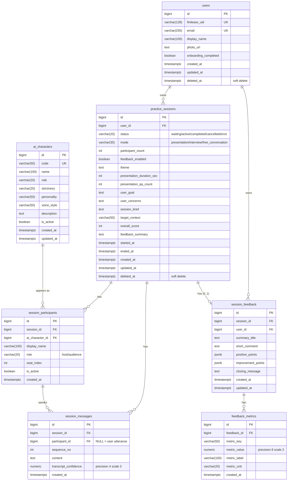

# DB Schema (ER Diagram)

AudienceRoom のデータベース構成図と、各テーブルの責務をまとめたドキュメント。

> 中心概念は `practice_sessions`。1 回の練習 = 1 `practice_session` という設計指針で全テーブルが繋がっている。

---

## ER 図

---

## テーブル責務

### `users`
Firebase Auth で認証されたアプリ利用者。`firebase_uid` で Firebase 側のユーザと紐づく。`deleted_at` による論理削除に対応。

### `ai_characters`
練習相手として登場する AI キャラクターのマスタ。`role` (host / audience)、`strictness` (厳しさ)、`personality`、`voice_style` などの属性を持つ。`is_active=false` で論理的に無効化できる。

### `practice_sessions` ★中心テーブル
1 回の練習セッションそのもの。`status` で進行状態 (`waiting` → `active` → `completed`)、`mode` で練習種別 (`presentation` / `interview` / `free_conversation`) を表す。終了時に AI が算出した `overall_score` と `feedback_summary` がここに反映される。

### `session_participants`
セッションごとに作られる「席」。同じ `ai_characters` でもセッションごとに `display_name` や `seat_index`、`role` を切り替えて出演する。「セッション内のキャラ配置」を表現するための中間テーブル的存在。

### `session_messages`
セッション中の発話履歴。`sequence_no` で順序を保証する。`participant_id IS NULL` なら**ユーザの発話**、それ以外なら**該当 AI 参加者の発話**。`transcript_confidence` には音声認識の信頼度が入る。

### `session_feedback`
セッション 1 つに対して 0 or 1 件の AI フィードバック。`positive_points` / `improvement_points` は配列を JSONB として保存（観点の数が可変なため）。

### `feedback_metrics`
1 つの `session_feedback` にぶら下がる定量メトリクス（例: 話速、フィラー回数、声の大きさなど）。`metric_key` / `metric_value` / `metric_unit` の汎用構造で複数項目を表現する。

---

## カーディナリティの読み方

| 関係 | 説明 |
| --- | --- |
| `users` 1—N `practice_sessions` | 1 ユーザは多数のセッションを持つ |
| `practice_sessions` 1—N `session_participants` | 1 セッションに複数の AI 参加者 |
| `ai_characters` 1—N `session_participants` | 同じキャラが複数セッションに出演 |
| `practice_sessions` 1—N `session_messages` | 発話履歴は時系列で増える |
| `session_participants` 1—N `session_messages` | 各参加者の発話を逆引きできる（NULL ならユーザ発話） |
| `practice_sessions` 1—**0..1** `session_feedback` | フィードバックは未生成のこともある |
| `session_feedback` 1—N `feedback_metrics` | 1 フィードバックに複数メトリクス |

---

## インデックス（パフォーマンス用）

`b3a1f7c8d92e_add_performance_indexes` で追加済み:

| Index | Table | Columns | 目的 |
| --- | --- | --- | --- |
| `ix_session_messages_session_seq` | `session_messages` | `(session_id, sequence_no)` | セッション内の会話履歴取得を高速化 |
| `ix_session_feedback_session_id` | `session_feedback` | `(session_id)` | セッション → フィードバック逆引き |
| `ix_feedback_metrics_feedback_id` | `feedback_metrics` | `(feedback_id)` | フィードバック詳細取得時のメトリクス JOIN |
| `ix_session_participants_session_seat` | `session_participants` | `(session_id, seat_index)` | セッション内参加者を席順で取得 |
| `ix_practice_sessions_user_deleted` | `practice_sessions` | `(user_id, deleted_at)` | ユーザのセッション一覧（論理削除を除外） |

---

## 設計上の注意点

- **`status` は CHECK 制約付き varchar**: Postgres の ENUM ではなく文字列 + CHECK で表現（CLAUDE.md ルール準拠、マイグレーション容易性のため）。
- **`session_messages.participant_id` の NULL は仕様**: ユーザ発話を表す。AI 発話は必ず NOT NULL になる。
- **`session_feedback` の `positive_points` / `improvement_points` は JSONB**: 観点の数や構造が可変なため正規化せず JSONB で持つ。検索クエリは現状想定していない。
- **論理削除**: `users` と `practice_sessions` のみ `deleted_at` を持つ。子テーブル（`session_messages` 等）は物理的に残る前提（親が論理削除されれば事実上参照不能）。
