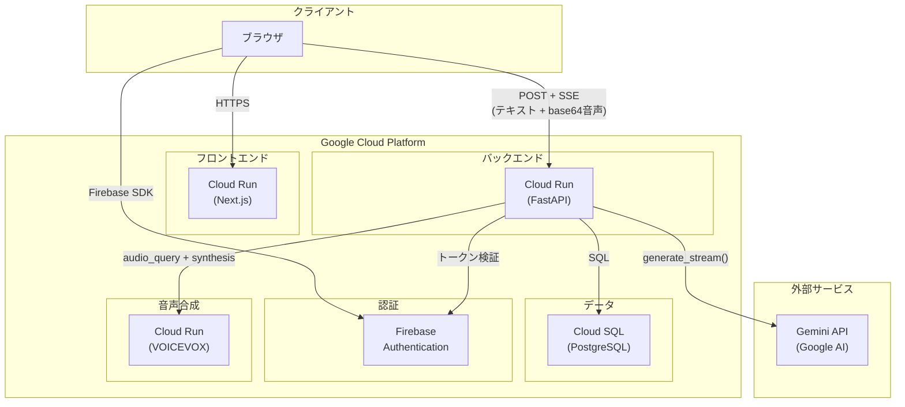
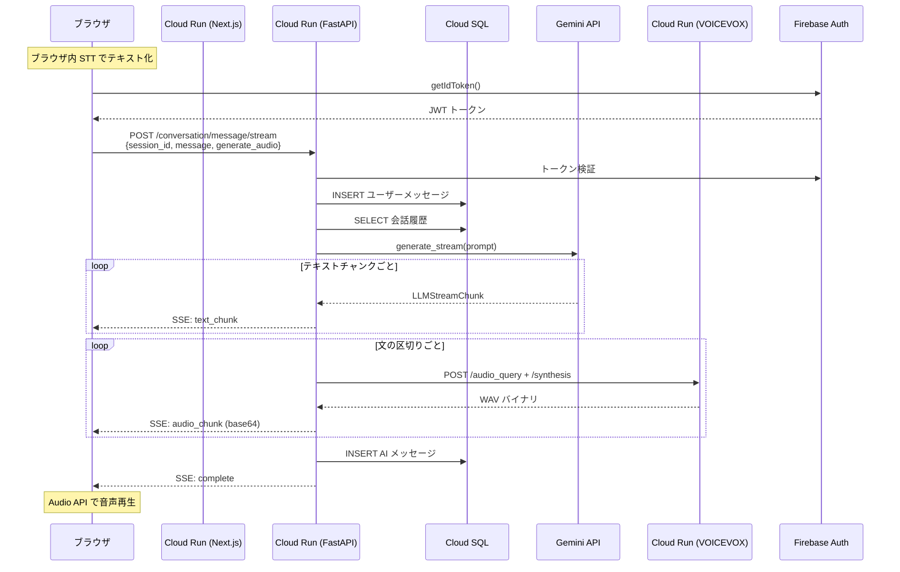

# Phase 1: 初期デプロイ構成

## 概要

MVP / 少人数利用を想定したシンプルな構成。
現在のコードベースをそのまま Cloud Run にデプロイできる。

## アーキテクチャ図

## 通信の流れ

## 各コンポーネントの設定

| コンポーネント | Cloud Run 設定 | 備考 |
|--------------|---------------|------|
| Next.js | CPU: 1, Memory: 512Mi, min: 0, max: 10 | 静的配信が主。負荷は低い |
| FastAPI | CPU: 2, Memory: 1Gi, min: 1, max: 20 | SSE 接続を保持するため min=1 推奨 |
| VOICEVOX | CPU: 2, Memory: 2Gi, min: 0, max: 5 | 音声合成は CPU バウンド |
| Cloud SQL | db-f1-micro → db-g1-small | セッション数に応じてスケールアップ |

## この構成の限界

| 問題 | 原因 | 影響が出る目安 |
|------|------|--------------|
| SSE 接続数の上限 | FastAPI コンテナが接続保持 + LLM/TTS 処理の両方を担う | 同時 50〜100 人 |
| 音声転送の帯域 | base64 WAV (1応答 200〜600KB) が SSE を通過 | SSE 接続時間が長引き、上記を悪化 |
| VOICEVOX のレイテンシ | 1文ごとに HTTP リクエスト（直列） | 長い応答で音声再生が遅れる |

これらの限界を超えるには [Phase 2](./phase2_scaling.md) の構成が必要。
