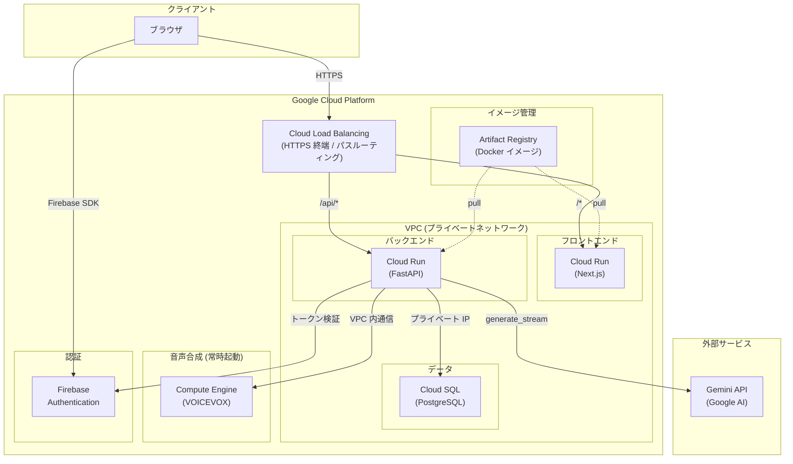
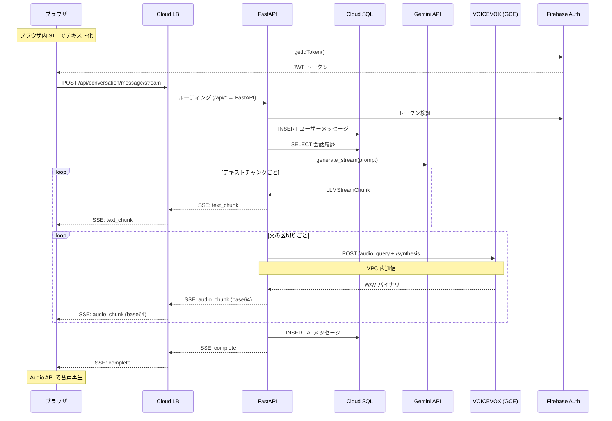

# Phase 1: 初期デプロイ構成

## 概要

MVP / 少人数利用を想定したシンプルな構成。
現在のコードベースをほぼそのまま GCP にデプロイできる。
VOICEVOX のみ、コールドスタート回避と CPU 性能確保のため Compute Engine（GCE）で常時起動する。

## アーキテクチャ図

**Cloud Load Balancing**: ブラウザからの全 HTTPS リクエストの入口。TLS 終端、パスベースルーティング（`/*` → Next.js、`/api/*` → FastAPI）、DDoS 防御を担う。SSE 接続もここを通るため、タイムアウト設定の延長（デフォルト30秒 → 数分）が必要。

**VPC**: Cloud SQL、VOICEVOX（GCE）、FastAPI 間の通信はプライベートネットワーク内で完結する。Cloud SQL はパブリック IP を持たず、VPC 内からのみアクセス可能。

**Compute Engine (VOICEVOX)**: VOICEVOX は CPU バウンドかつ起動に時間がかかるワークロードであり、Cloud Run のコールドスタート（10〜30秒）と相性が悪い。GCE で常時起動することで安定したレイテンシを確保する。VPC 内の内部 IP で Backend から通信する。

**Artifact Registry**: Cloud Build や GitHub Actions で Docker イメージをビルドし、ここに push する。Cloud Run サービスはデプロイ時にここからイメージを pull する。VOICEVOX は GCE 上で Docker を直接実行する。

## 通信の流れ

## 各コンポーネントの設定

| コンポーネント | インフラ | 設定 | 備考 |
|--------------|---------|------|------|
| Next.js | Cloud Run | CPU: 1, Memory: 512Mi, min: 0, max: 10 | 静的配信が主。負荷は低い |
| FastAPI | Cloud Run | CPU: 2, Memory: 1Gi, min: 1, max: 20 | SSE 接続を保持するため min=1 推奨 |
| VOICEVOX | **Compute Engine** | e2-standard-2 (2 vCPU, 8GB) | 常時起動。コールドスタート回避 |
| Cloud SQL | マネージド | db-f1-micro → db-g1-small | セッション数に応じてスケールアップ |

## なぜ VOICEVOX だけ Compute Engine か

Cloud Run は「リクエストが来たらコンテナを起動し、終わったら落とす」リクエスト駆動型のサービス。
VOICEVOX をここに載せると以下の問題が発生する。

| 問題 | 原因 |
|------|------|
| コールドスタート 10〜30秒 | VOICEVOX の Docker イメージが大きく、音声モデルの初期化に時間がかかる |
| 合成速度の低下 | Cloud Run の共有 vCPU は CPU バウンドな音声合成に不向き |
| min=1 でもコスト非効率 | Cloud Run の常時起動課金は GCE より割高 |

VOICEVOX は「CPU バウンド・起動コスト大・常時リクエストを受ける」ワークロードであり、
IaaS（GCE）で常時起動する方が、コスト・レイテンシ両面で優れている。

**ワークロードの特性に応じてマネージドサービス（Cloud Run）と IaaS（GCE）を使い分ける** のがクラウド設計のポイント。

## この構成の限界

| 問題 | 原因 | 影響が出る目安 |
|------|------|--------------|
| SSE 接続数の上限 | FastAPI コンテナが接続保持 + LLM/TTS 処理の両方を担う | 同時 50〜100 人 |
| 音声転送の帯域 | base64 WAV (1応答 200〜600KB) が SSE を通過 | SSE 接続時間が長引き、上記を悪化 |
| VOICEVOX のスケール上限 | GCE は単一インスタンスのため水平スケールしない | 同時 10〜20 リクエスト |

これらの限界を超えるには [Phase 2](./phase2_scaling.md) の構成が必要。
