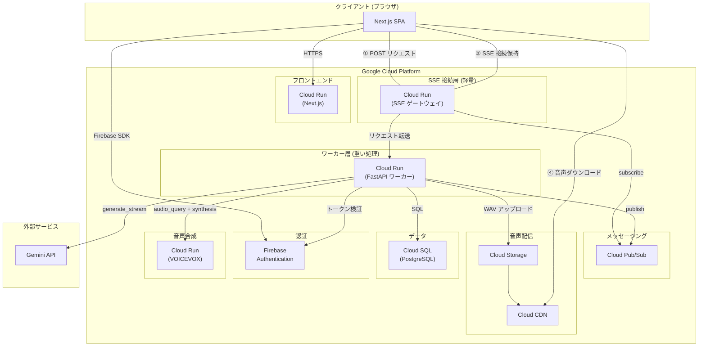
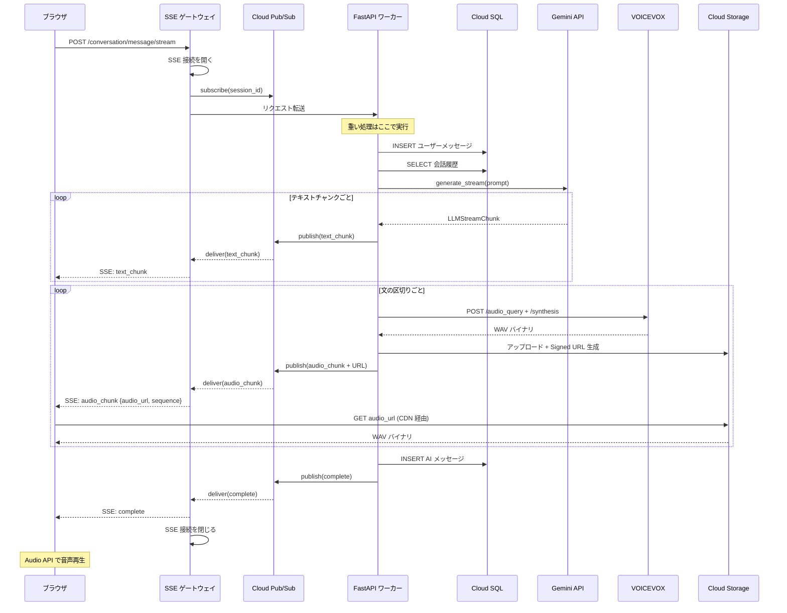

# Phase 2: スケーリング構成

## 概要

Phase 1 の2つの限界を、クラウドインフラの分離で解決する。

| 課題 | 解決策 | 分離の考え方 |
|------|--------|------------|
| SSE 接続がコンテナを占有する | Cloud Pub/Sub で「接続保持」と「重い処理」を分離 | 接続保持 → SSE ゲートウェイ、計算 → ワーカー |
| base64 音声が SSE 帯域を圧迫する | Cloud Storage + Signed URL で音声配信を分離 | 音声配信 → Cloud Storage (+ Cloud CDN) |

## アーキテクチャ図



## 通信の流れ



## Phase 1 からの変更点

### 1. SSE ゲートウェイの導入

Phase 1 では FastAPI コンテナが SSE 接続を保持しつつ LLM/TTS の重い処理を行っていたため、
1接続 = 1コンテナの concurrency 枠を長時間占有していた。

Phase 2 では SSE ゲートウェイが接続保持のみを担う。
処理は「Pub/Sub からメッセージを受け取り、SSE で転送する」だけなので非常に軽く、
1インスタンスで数千接続を捌ける。

```
Phase 1:
  [コンテナ] = SSE 接続保持 + LLM 呼び出し + TTS 生成
  → 1接続で concurrency 1枠を 10秒占有
  → 80並列で飽和

Phase 2:
  [SSE ゲートウェイ] = Pub/Sub → SSE 転送のみ
  → 1インスタンスで数千接続可能
  → CPU をほぼ使わない

  [ワーカー] = LLM + TTS 処理のみ
  → 処理が終わったら即解放
  → 接続を保持しない
```

### 2. Cloud Storage + Signed URL による音声配信分離

Phase 1 では base64 エンコードされた WAV (1文あたり 50〜150KB) が SSE ストリームを通過していた。
1応答で 2〜4 文 → 合計 200〜600KB が SSE を経由し、接続時間を長引かせていた。

Phase 2 ではワーカーが WAV を Cloud Storage にアップロードし、
期限付き Signed URL だけを SSE で送る。ブラウザは Cloud Storage (CDN 経由) から直接音声をダウンロードする。

```
Phase 1: SSE で送るもの
  text_chunk: {"text": "はい、"}                                   ~50 バイト
  audio_chunk: {"audio_base64": "UklGR...(150KB)...", "sequence": 1}  ~150 KB

Phase 2: SSE で送るもの
  text_chunk: {"text": "はい、"}                                   ~50 バイト
  audio_chunk: {"audio_url": "https://storage.../a.wav", "sequence": 1}  ~200 バイト

→ SSE を通るデータ量が 1/1000 に削減
→ SSE 接続時間が短縮され、ゲートウェイの接続効率がさらに向上
```

## 各コンポーネントの設定

| コンポーネント | Cloud Run 設定 | 役割 |
|--------------|---------------|------|
| Next.js | CPU: 1, Memory: 512Mi, min: 0, max: 10 | 静的配信 |
| SSE ゲートウェイ | CPU: 1, Memory: 256Mi, min: 1, max: 10 | SSE 接続保持 + Pub/Sub → SSE 転送 |
| FastAPI ワーカー | CPU: 2, Memory: 1Gi, min: 0, max: 50 | LLM/TTS 処理。接続を保持しないため min=0 可能 |
| VOICEVOX | CPU: 2, Memory: 2Gi, min: 0, max: 10 | 音声合成 |
| Cloud SQL | db-g1-small〜 | Phase 1 と同じ |
| Cloud Pub/Sub | マネージド | メッセージ中継。設定不要 |
| Cloud Storage | Standard | 音声ファイル保存。TTL でライフサイクル管理 |

## 追加遅延の影響

| 経路 | Phase 1 | Phase 2 | 差分 |
|------|---------|---------|------|
| テキスト配信 | 直接 SSE (0ms) | Pub/Sub 経由 (+20〜50ms) | 体感差なし（LLM 生成自体が秒単位） |
| 音声配信 | SSE 内 base64 (0ms) | Storage アップロード + CDN DL (+50〜100ms) | 体感差なし（TTS 生成自体が数百ms） |

LLM の生成や TTS の合成自体が秒〜数百ms 単位なので、中継の数十ms はユーザー体験に影響しない。
